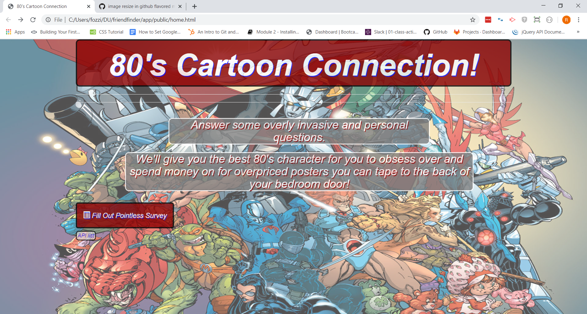
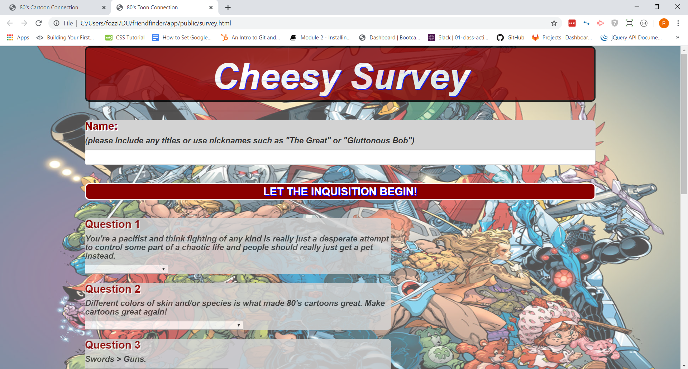

# 80's Cartoon Connection 
### aka: Friend Finder App

Ah, the 80's. Big hair, rock love ballads, and Saturday Morning Cartoons. Ever wonder which of the animated characters you would get along with best? Wonder no more! The 80's Cartoon Connection app will tell you after you answer a few simple questions.

## Links

live: https://desolate-scrubland-50758.herokuapp.com

github: https://github.com/RichardHamp/friendfinder

## Usage

To use the app, simply surf over to the homepage (located at ****). From there you can take a look at all the options by clickign the API list link at the bottom, or start the survey by clicking the "Fill Out Pointless Survey" button. Fill in the blanks and questions, then hit "Tell me my cartoon connection!"

## Technologies Used

- JavaScript
- jQuery
- node.js
- Express.js
- HTML
- Bootstrap